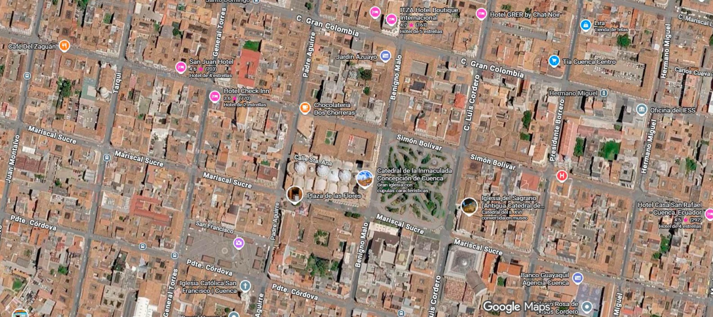
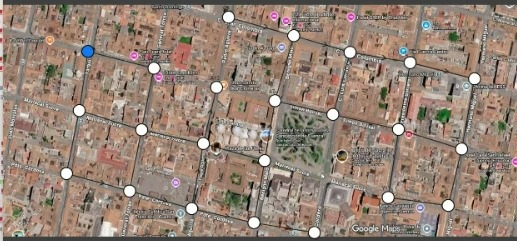

# Implementación y visualización de rutas en un mapa de calles mediante BFS y DFS


- **Universidad:**  Politecnica Salesiana 
- **Carrera:** Computación
- **Asignatura:** Estructura de Datos
- **Proyecto:** Proyecto Final - Implementación y visualización de rutas en un mapa
  de calles mediante BFS y DFS
- **Docente:** Ing. Pablo Torres
- **Integrantes:**
  - David Fajardo
  - Martin Villacres
  - Kevin Sacaquirin
  - Miguel Maza


## Objetivo

El objetivo es realizar una aplicación en Java que represente un mapa de calles como un grafo, donde las intersecciones sean nodos y las calles aristas sobre una imagen de fondo.
Implementar los algoritmos BFS , DFS  , Greedy y A* para encontrar rutas entre un punto de inicio (A) y un destino (B).
Mostrar visualmente el recorrido de búsqueda y la ruta final encontrada.

## Descripción del problema

Un mapa de calles puede representarse como un grafo, donde las intersecciones son vértices y las calles son aristas.
Para encontrar una ruta entre dos puntos se utilizan los algoritmo, que encuentra el camino con menos calles y que explora primero los caminos más profundos.
La aplicación permite visualizar el recorrido de búsqueda y la ruta encontrada de forma gráfica.
## Marco teórico

**Grafos.** Un grafo `G = (V, E)` está compuesto por un conjunto de vértices `V`
y un conjunto de aristas `E` que conectan pares de vértices. En este proyecto se
representa mediante una lista de adyacencia: un mapa donde cada nodo apunta al
conjunto de nodos alcanzables directamente desde él.

**BFS (Breadth-First Search).** Recorre el grafo por niveles, utilizando una
cola (FIFO). Visita primero todos los vecinos directos del nodo de inicio, luego
los vecinos de esos vecinos, y así sucesivamente. Como explora nivel por nivel,
la primera vez que alcanza el destino, la ruta reconstruida es la de menor
cantidad de aristas.

**DFS (Depth-First Search).** Recorre el grafo profundizando en una rama antes
de retroceder. Puede implementarse con recursividad (como en este proyecto) o
con una pila explícita. Cuando una rama no conduce al destino, se hace
*backtracking*: se elimina el último nodo agregado a la ruta actual y se
continúa explorando otra rama.

## Tecnologías utilizadas

- Java (JDK 21), sin librerías externas de grafos ni de algoritmos de búsqueda.
- Swing (`javax.swing`) para la interfaz gráfica de escritorio.
- Persistencia mediante archivo de texto plano en formato CSV, leído y escrito
  con clases estándar de `java.io` / `java.nio`.
- Control de versiones con Git y GitHub.

## Arquitectura y estructura de carpetas

El proyecto aplica el patrón **Modelo-Vista-Controlador (MVC)**, reutilizando
las clases genéricas de grafos (`Graph<T>`, `Node<T>`, `PathFinder<T>`,
`PathResult<T>`) trabajadas en clase, adaptadas para almacenar `MapPoint` como
valor genérico.

```
src/
├── App.java                          
├── controllers/
│   └── MapController.java            
├── models/
│   ├── MapPoint.java                 
│   └── VisualizationMode.java       
├── persistence/
│   ├── GraphRepository.java          
│   └── FileGraphRepository.java      
├── structures/
│   ├── node/
│   │   └── Node.java                 
│   └── graphs/
│       ├── Graph.java                
│       ├── PathFinder.java          
│       ├── PathResult.java          
│       └── implementations/
│           ├── BFSPathFinder.java
│           └── DFSPathFinder.java
└── views/
    ├── MainFrame.java              
    └── MapPanel.java                 

resources/
├── maps/
│   └── map.png                       
└── config/
    └── graph_config.csv             
```

**Responsabilidades por capa:**

- **Modelo** (`models`, `structures`): `MapPoint`, `Graph<MapPoint>`, los
  resultados de búsqueda y la configuración persistida.
- **Vista** (`views`): dibuja el mapa, los puntos, las calles y el recorrido.
  No contiene lógica de BFS/DFS.
- **Controlador** (`controllers`): recibe la interacción del usuario, modifica
  el grafo, ejecuta BFS/DFS a través de `PathFinder`, y delega el guardado a
  `GraphRepository`.

## Diagrama UML

```
 Graph<T> 1 ---- * Node<T> ---- T (valor genérico, en este proyecto MapPoint)

 PathFinder<T>  <<interface>>
        ▲
        |
   ------------------
   |                |
BFSPathFinder<T>  DFSPathFinder<T>

 MapController --uses--> Graph<MapPoint>
 MapController --uses--> PathFinder<MapPoint> (BFS/DFS)
 MapController --uses--> GraphRepository <<interface>>
                              ▲
                              |
                     FileGraphRepository

 MainFrame --uses--> MapController
 MainFrame *-- MapPanel
```


## Funcionamiento general

1. Al iniciar la aplicación, `FileGraphRepository.load()` lee
   `resources/config/graph_config.csv` (si existe) y reconstruye el grafo.
2. El usuario puede agregar puntos haciendo clic sobre el mapa (modo
   "Agregar punto"), crear calles entre dos puntos (modo "Agregar calle",
   eligiendo si es bidireccional) o eliminar puntos (modo "Eliminar punto").
   Cada cambio se guarda automáticamente mediante
   `FileGraphRepository.save(...)`.
3. El usuario elige un nodo de inicio, un nodo de destino, un algoritmo (BFS o
   DFS) y un modo de visualización (Exploración o Ruta final), y presiona
   "Ejecutar".
4. `MapController.ejecutarBusqueda(...)` invoca al `PathFinder` correspondiente,
   que devuelve un `PathResult` con el orden de nodos visitados y la ruta
   encontrada. La lógica de búsqueda es idéntica sin importar el modo elegido.
5. `MainFrame` anima el resultado sobre `MapPanel`:
   - **Exploración:** revela progresivamente cada nodo visitado y, al
     terminar, resalta la ruta final.
   - **Ruta final:** omite la exploración intermedia y dibuja únicamente la
     ruta reconstruida, de forma progresiva.

## Capturas de pantalla






## Ejemplo comentado: BFS

```java
public PathResult<T> find(Graph<T> graph, T start, T end) {
    Queue<T> queue = new LinkedList<>();      
    Set<T> visitados = new HashSet<>();       
    Set<T> ordenVisita = new LinkedHashSet<>(); 
    Map<T, T> predecesores = new HashMap<>();  

    queue.add(start);
    visitados.add(start);
    predecesores.put(start, null);

    while (!queue.isEmpty()) {
        T actual = queue.poll();
        ordenVisita.add(actual);

        if (actual.equals(end)) {
            return new PathResult<>(ordenVisita, buildPath(predecesores, end));
        }

        for (Node<T> vecino : graph.getVecinos(actual)) {
            if (!visitados.contains(vecino.getValue())) {
                visitados.add(vecino.getValue());
                predecesores.put(vecino.getValue(), actual);
                queue.add(vecino.getValue());
            }
        }
    }
    return new PathResult<>(ordenVisita, new LinkedHashSet<>()); 
}
```

El algoritmo explora el grafo por niveles gracias a la cola: primero procesa
todos los vecinos directos del nodo de inicio antes de avanzar al siguiente
nivel. El mapa `predecesores` guarda, para cada nodo descubierto, quién lo
descubrió; al llegar al destino, `buildPath` recorre ese mapa hacia atrás para
reconstruir la ruta completa desde el inicio.

## Tabla comparativa de resultados
| Caso | Algoritmo | Inicio | Destino | Nodos visitados | Ruta encontrada | Tiempo |
|------|-----------|--------|---------|------------------|------------------|--------|
| 1 | DFS | F | X | G, H, I, J, K, O, A12, L, A7, P, S, Y, X (13) | F, G, H, I, J, K, O, A12, L, A7, P, S, Y, X (14 nodos / 13 aristas) | 0,150 ms |
| 1 | BFS | F | X | F, G, A4, H, N, A10, I, A9, A7, A6, J, L, P, D, K, A12, S, B, O, W, Y, A2, A3, X (24) | F, A4, A10, A7, P, S, Y, X (8 nodos / 7 aristas) | 0,196 ms |
| 1 | Greedy | F | X | F, A4, A10, A7, P, V, Y, X (8) | F, A4, A10, A7, P, V, Y, X (8 nodos / 7 aristas) | 2,100 ms |
| 1 | A* | F | X | F, A4, A10, A7, P, V, Y, X (8) | F, A4, A10, A7, P, V, Y, X (8 nodos / 7 aristas) | 1,465 ms |

- **¿Qué tan distinto fue el orden de exploración entre BFS y DFS?** 
DFS visitó solo 13 nodos porque siguió casi una única rama del grafo y necesitó pocos retrocesos. En cambio, BFS exploró muchos más nodos al recorrer el grafo por niveles, revisando vecinos que no formaban parte de la ruta final, aunque con la ventaja de garantizar el camino más corto.


**Análisis:**

- **¿Qué tan distinto fue el orden de exploración entre BFS y DFS?** 
Bastante distinto el DFS visitó 13 nodos porque En este caso, DFS encontró la ruta recorriendo casi una sola rama (F -G - H - I - J - K - O - A12 - L - A7-.. ), por lo que exploró menos nodos y necesitó pocos retrocesos.
En cambio, BFS visitó muchos más nodos porque explora el grafo por niveles, revisando primero todos los vecinos antes de avanzar.
Por eso terminó recorriendo nodos que no formaban parte de la ruta final, aunque garantiza encontrar el camino con el menor número de calles.

- **¿BFS encontró siempre la ruta con menos aristas?**
 En este caso sí, y por bastante margen: BFS encontró una BFS encontró una ruta más corta de 7 aristas, mientras que DFS obtuvo una de 13 aristas porque sigue el primer camino disponible y no busca el más corto. Sin embargo, con un solo caso de prueba no se puede concluir que esto siempre ocurra.

- **¿DFS llegó a encontrar rutas distintas a las de BFS?** 
Sí, totalmente distinta. La ruta de DFS pasa por nodos que la de BFS ni toca (G, H, I, J, K, O, A12, L), lo que tiene sentido porque DFS simplemente sigue la primera rama disponible en vez de buscar el camino más corto.

- **¿Cuál algoritmo visitó más nodos?** 
BFS visito 24 nodos. Le siguen DFS con 13, y Greedy y A* quedaron muy por debajo, con 8 nodos cada uno — en este caso visitaron exactamente los mismos nodos que terminaron en la ruta final, sin nodos de más, porque al usar una heurística van directo hacia el destino en vez de explorar a ciegas.

- **¿Cómo influyó la estructura del grafo?** 
Los nodos intermedios hicieron que BFS explorara muchos desvíos antes de llegar al destino. DFS revisó menos nodos porque la primera rama que siguió sí conducía al objetivo, aunque no era la más corta. En cambio, Greedy y A* encontraron la ruta de forma más directa gracias a su heurística.

- **¿Qué ventaja da separar la lógica del algoritmo de la visualización?** 
La interfaz PathFinder<T> permitió agregar Greedy y A* sin modificar MapPanel ni MainFrame, simplemente creando nuevas clases. Además, facilitó medir el tiempo de ejecución de cada algoritmo sin que la animación influyera en los resultados.

- **¿Qué habría que cambiar para trabajar con calles ponderadas?** 

EN el Graph<T> solo almacena las conexiones entre nodos y no el peso de las aristas. Al agregar pesos como distancia o tiempo de viaje, sería posible mejorar Greedy y A* con una heurística más precisa e incorporar Dijkstra para comparar su rendimiento con los demás algoritmos.

## Cómo ejecutar el proyecto

Requiere JDK 17 o superior.

```bash
# Compilar
javac -d bin -encoding UTF-8 $(find src -name "*.java")

# Ejecutar (debe ejecutarse desde la raíz del proyecto, para que
# resources/maps/map.png y resources/config/graph_config.csv se
# encuentren correctamente)
java -cp bin App
```

También puede abrirse directamente en Visual Studio Code con la extensión
"Extension Pack for Java" y ejecutarse desde `src/App.java`.

## Pruebas realizadas

Se probaron los siguientes escenarios 

1. Agregar nodo.
2. Evitar identificadores repetidos.
3. Eliminar nodo y sus conexiones.
4. Agregar arista bidireccional.
5. Agregar arista unidireccional.
6. Eliminar arista.
7. Guardar y volver a cargar la configuración.
8. Redimensionar la ventana (la imagen conserva su proporción).
9. Ruta directa entre dos nodos conectados.
10. Ruta con varios nodos intermedios.
11. Grafo con varias rutas posibles.
12. Nodo de inicio igual al nodo destino.
13. Nodo destino sin conexión (no existe ruta).
14. Identificador inexistente.
15. Ejecución en modo exploración.
16. Ejecución en modo ruta final.
17. Carga de configuración válida.
18. Carga de configuración con errores (líneas inválidas se ignoran y se
    reportan por consola).

## Conclusiones

David Fajardo: 
El controlador cumple un rol intermediario entre la lógica de negocio y la vista. La interfaz tiene activado los listener necesarios para cumplir con las distintas opciones, por ejemplo, agregar, eliminar, conectar y buscar caminos entre los distintos nodos, el controlador, con esta información el controlador delega, por ejemplo, la búsqueda al PathFinder correspondiente y guarda el estado después de cada operación mediante una persistencia. El método SeleccionarFinder desacopla la interfaz gráfica del algoritmo elegido, lo cual facilita en primeras instancias, agregar nuevas búsquedas o algoritmos sin modificar gran parte del código.

Kevin Sacaquirín: 
Lo mas relevante de las clases de dominio e interfaces, es su estructura genérica, permitiendo que almacenen distintos valores sin necesidad de condiciona a usar un solo tipo de dato. Las interfaces PathFinder y GraphRepository funcionan como contratos que separan el que se realiza, del como se realiza. Esto abre las puertas a distintas implementaciones de busqueda y persistencia, considero que esta abstraccion es la base que sostiene una fleibilidad extendible en el proyecto.

Miguel Maza:
Al momento de revisar la interfaz gráfica y tener comprendido la separación de vista de la lógica de MapPanel y MainFrame que son los que se encargan de como el usuario dibuja los puntos, calles y de las animaciones sin mezclar acciones con modificaciones al código. Esto se puede observar de mejor manera en el modo de visualización que cambia solamente lo de las animaciones sin alterar el resultado. Fue un ejercicio de comprender como Swing puede mantenerse limpio cuando no ocupa funcionalidades que no le corresponden.

Martín Villacrés:
Pude comprender que la función de las implementaciones del BFS, DFS, GreddyBestFirst y A-star sobre la interfaz PathFinder permite aclarar la exploración por niveles y la exploración guiada por la clase heurística. BFS se encarga se verificar la ruta con menos aristas gracias a la cola utilizada, DFS con su recursividad y el BackTracking implementado no asegura tener la ruta más optima pero garantiza menor ocupación de memoria,Greddy y A-star incorporan la heurística para orientar el recorrido y permitir que independientemente recorran y busquen la ruta optima.

## Recomendaciones y aplicaciones futuras

- Validar la configuración antes de construir el grafo (ya implementado en
  `FileGraphRepository`, que ignora y reporta líneas inválidas).
- Extender el modelo `MapPoint`/`Graph` para soportar calles ponderadas (por
  ejemplo, agregando una distancia o tiempo estimado a cada arista) y así
  poder aplicar Dijkstra o A* en un trabajo futuro.
- Separar por completo la ejecución del algoritmo de las animaciones al medir
  tiempos de ejecución, para no incluir el tiempo de dibujo en la medición.
- Probar el sistema con grafos desconectados y con ciclos, además de los
  casos ya cubiertos.
